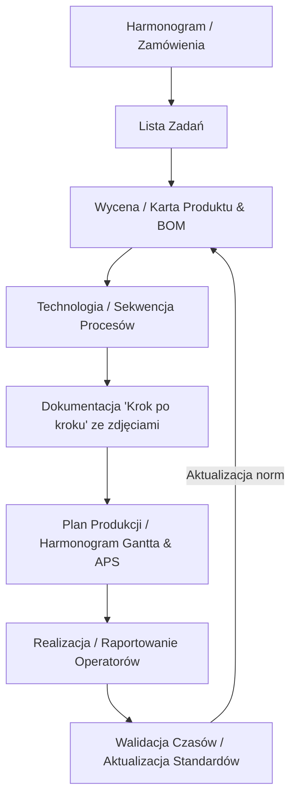

# Plan wdrożenia Systemu Wycen Technologii i Planowania (SWTP)

Ten dokument zawiera plan działania krok po kroku w celu zbudowania aplikacji SWTP wspomagającej wyceny, technologię i planowanie produkcji. Projekt zostanie zrealizowany w języku Python (przy użyciu biblioteki **Streamlit** lub **FastAPI + HTMX/JS**), z bazą danych **SQLite**, mieszcząc się w maksymalnie 3 plikach źródłowych zgodnie z założeniami.

---

## 🛠️ Architektura i Stack Technologiczny

1. **Język**: Python z polskim nazewnictwem w kodzie oraz obszernymi komentarzami po polsku.
2. **Interfejs**: **Streamlit** (zalecany) – pozwala na szybkie tworzenie interfejsów bazodanowych, wykresów Gantta oraz formularzy w jednym pliku, idealnie spełniając limit 1-3 plików.
3. **Baza Danych**: SQLite (`swtp.db`) ze strukturą umożliwiającą łatwy eksport/migrację.
4. **Integracje**: Obsługa bibliotek `pandas` i `openpyxl` do wczytywania danych z Excela.
5. **Zależności**: Plik [requirements.txt](file:///home/konrad/SWTP/requirements.txt) zawierający listę wymaganych pakietów zewnętrznych.

---

## 📂 Diagram Przepływu Danych (Mermaid)

---

## 📋 Szczegółowe Kroki Realizacji

### Krok 1: Przygotowanie Bazy Danych i Import Danych
*   Inicjalizacja pliku bazy SQLite `swtp.db`.
*   Stworzenie skryptu automatycznie wczytującego początkowe dane z:
    *   Listy maszyn: [Maszyny.xlsx](file:///home/konrad/SWTP/data/Maszyny.xlsx)
    *   Listy materiałów: [Materiały.xlsx](file:///home/konrad/SWTP/data/Materiały.xlsx) (uwaga: w specyfikacji wspomniano `Towary.xlsx`, system obsłuży oba warianty).
*   Projekt tabel w bazie:
    *   `uzytkownicy` (login, hasło hash, rola)
    *   `zamowienia` (id, nr_zamowienia, status, termin, priorytet)
    *   `produkty` (nr_produktu, nazwa, opis, sciezka_kroju, status)
    *   `bom` (id_produktu, id_materialu, ilosc)
    *   `procesy_wyceny` (id_produktu, id_maszyny, proces, czas_standardowy, korekta_gabaryt)
    *   `procesy_technologiczne` (id_produktu, kolejny_krok, nazwa_procesu, przypisany_czas)
    *   `realizacja` (id_zamowienia, id_procesu, czas_start, czas_stop, operator)

### Krok 2: Panel Uwierzytelniania i Autoryzacji
*   Ekran logowania zdefiniowany w głównym pliku Python.
*   Rozróżnienie ról użytkowników:
    *   `ORDERS` / `Planista` (Harmonogram, Planowanie)
    *   `Konstruktor` (Rysunki, BOM, Wycena)
    *   `Operator` (Realizacja i raportowanie pracy w LAN)
    *   `Menedżer` (Raporty walidacji, edycja stawek, importy Excel)
*   **Zarządzanie kontami użytkowników (NOWOŚĆ)**:
    *   Administrator (Menedżer) posiada dedykowany moduł pozwalający na przeglądanie kont, dodawanie nowych użytkowników oraz bezpieczne ich usuwanie (blokada przed usunięciem konta głównego `admin`).

### Krok 3: Harmonogram i Lista Zadań (Kroki 1-2 z założeń)
*   **Dla ORDERS**: Formularz dodawania nowych zapytań/zamówień od klientów i z Danii.
*   **Dla Planisty**: Panel kolejkowania zadań. Możliwość ręcznego przeciągania kolejności lub automatycznego sortowania po terminie realizacji (kolejka FIFO/EDD).

### Krok 4: Karta Produktu, BOM i Wycena (Krok 3 z założeń)
*   **Karta Produktu**: Generowanie numeru według maski `xxx-xxxx-xxx`.
*   **Integracja z Konstruktorem**: Pole do wskazania ścieżki pliku kroju (katalog `IA`), metrażu szycia/zgrzewania oraz długości pasów.
*   **Tworzenie BOM**: Wyszukiwarka i wybór materiałów z zaimportowanej bazy [Materiały.xlsx](file:///home/konrad/SWTP/data/Materiały.xlsx) z opcją ręcznej edycji ilości i cen.
*   **Kalkulator Kosztów**:
    *   Wybór maszyny/ludzi i przyporządkowanie procesów.
    *   Pobieranie kosztów roboczogodziny z tabeli maszyn.
    *   Modyfikator czasu standardowego (np. suwak dla dużego gabarytu).
    *   Podsumowanie: `Suma BOM` + `Suma Robocizny` = `Koszt Wyceny`.

### Krok 5: Technologia i Karta Technologiczna (Krok 4 z założeń)
*   Agregacja procesów z wyceny do ustrukturyzowanej listy (Krojenie, Nadruk, Szycie, Zgrzewanie HF, Okucia, Pakowanie itp.).
*   Możliwość edycji BOM i dodawania uwag technologicznych bezpośrednio z poziomu technologii.

### Krok 6: Dokumentacja Produkcyjna (Krok 5 z założeń)
*   Generowanie chronologicznej instrukcji wykonania ("Krok po kroku") dla produkcji.
*   Moduł wgrywania i podglądu zdjęć/ilustracji do każdego z kroków procesu w celu ułatwienia pracy operatorom.

### Krok 7: Planowanie Produkcji (APS) i Wykres Gantta (Krok 6 z założeń)
*   Wizualizacja planu na interaktywnym wykresie Gantta (za pomocą biblioteki Plotly).
*   **Algorytm Szeregowania APS**:
    *   Szeregowanie "od tyłu" (Backward Scheduling) od zadeklarowanego terminu dostawy.
    *   Identyfikacja wąskiego gardła (np. zgrzewarki HF).
    *   Automatyczne wypełnianie wolnych mocy przerobowych mniej pilnymi zleceniami (np. mniejsze plandeki).
    *   Prezentacja dwóch kluczowych dat: pierwszego możliwego startu (dostępność maszyn/surowców) i ostatniego możliwego startu.
*   **Symulacja "Co jeśli" (Awaria)**:
    *   Możliwość symulowania awarii lub przestojów maszyn.
    *   Automatyczne przeliczanie harmonogramu i generowanie planów alternatywnych (np. nadgodziny vs zmiana priorytetów).
*   **Zrzut Planu**: Generowanie dedykowanych list zadań dla poszczególnych maszyn 2 razy na dobę lub na żądanie.

### Krok 8: Realizacja Produkcji w Czasie Rzeczywistym (Krok 7 z założeń)
*   Uproszczony interfejs dla operatorów na tabletach/komputerach w sieci LAN.
*   Możliwość "odbijania" (start, stop, pauza) kolejnych zadań z wygenerowanej listy dla danej maszyny.

### Krok 9: Raport Walidacji Norm Czasowych (Krok 8 z założeń)
*   Zestawienie czasów planowanych (normatywnych) z rzeczywistymi zebranymi z produkcji.
*   Wskaźniki odchyleń (KPI) i rekomendacje zmian czasów standardowych w bazie maszyn.

---

## 📈 Kamienie Milowe i Sugerowany Podział Plików

W celu utrzymania projektu w przejrzystej strukturze **1-3 plików**:

*   `app.py`: Główny plik aplikacji (Routing, Streamlit UI, ekrany modułów od 1 do 8 w tym zarządzanie użytkownikami).
*   `database.py`: Definicja bazy danych, modele SQLite (SQLAlchemy lub czysty sqlite3), skrypty importu Excel oraz zapytania do zarządzania kontami.
*   `scheduler.py`: Silnik APS, logika obliczeń czasu, szeregowanie wsteczne i generowanie wykresów Gantta.
*   `requirements.txt`: Plik z wymaganiami pakietów dla środowiska wirtualnego.
